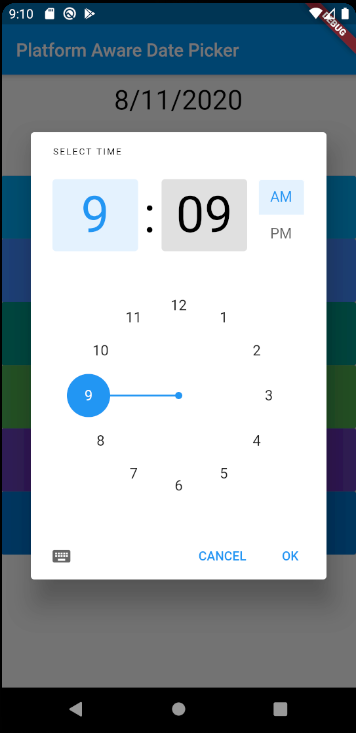
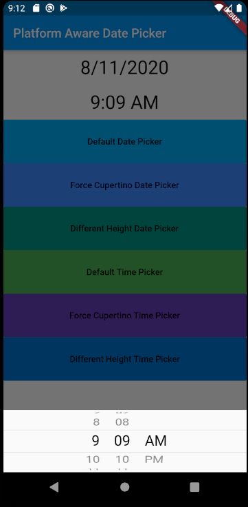

# Platform Aware Date Picker

This package will automatically show either the Cupertino or Material Date Picker and Time Picker depending on the platform specified.

## Usage

To use this plugin, add `platform_date_picker` as a dependency in your pubspec.yaml file.

## Getting Started

Simply call the top-level functions `showPlatformDatePicker()` or `showPlatformTimePicker()` and it will show the appropiate date or time picker depending on the platform. The functions return `Future<DateTime?>` and `Future<TimeOfDay?>` respectively depending on if the user selects a date or time,. Pass in the same parameters as you would for calling the function `showDatePicker()` or `showTimePicker()`.

```
DateTime? date = await showPlatformDatePicker(
    context: context,
    firstDate: DateTime(DateTime.now().year - 2),
    initialDate: DateTime.now(),
    lastDate: DateTime(DateTime.now().year + 2),
);
```

 

You can also force the function to show either the Cupertino or Material date or time picker by setting the `showCupertino` or `showMaterial` fields.

```
TimeOfDay? temp = await showPlatformTimePicker(
    context: context,
    initialTime: TimeOfDay.fromDateTime(DateTime.now()),
    showCupertino: true,
);
```

 

Finally you can set the height of the Cupertino date or time picker by setting the `height` field. The default value is the bottom third of the screen.

 

## Dark Mode

This package only supports correct theme handling with MaterialApp not with CupertinoApp. In the `darkTheme` property of MaterialApp, add the following:

```
darkTheme: ThemeData(
    cupertinoOverrideTheme: const CupertinoThemeData().copyWith(
        textTheme: CupertinoThemeData().textTheme.copyWith(
            navTitleTextStyle: CupertinoThemeData()
                .textTheme
                .navTitleTextStyle
                .apply(color: Colors.white),
        ),
    ),
),
```

### Explanation

The theming issue stems from the differing color patterns, with CupertinoApp supporting dynamic colors that change depending on the platform brightness. More specifically, this package uses `showModalBottomSheet` instead of `showCupertinoModalPopup` which means that the background and font colors will change based off of the current theme object `ThemeData` i.e. `Theme.of(context)`. However, when using CupertinoApp the Theme is set using the `CupertinoThemeData` class, so theme changes will not behave the same. In order to provide a consistent experience for now, you show avoid using this package if you want a dark theme using CupertinoApp. Dark Theme support for CupertinoApp may be added in the future. 
