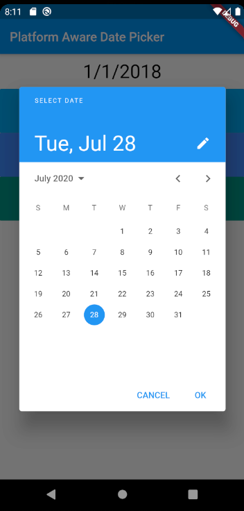
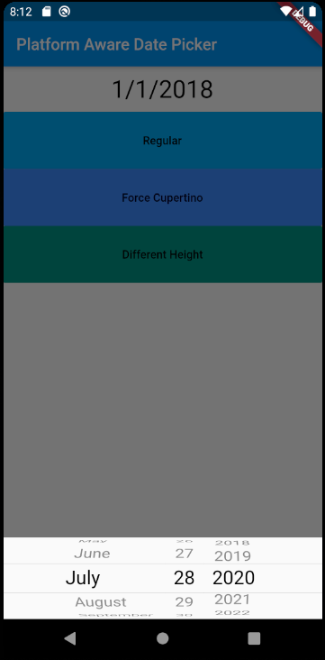

# Platform Aware Date Picker

This package will automatically show either the Cupertino or Material Date Picker depending on the platform specified.

## Usage

To use this plugin, add `platform_date_picker` as a dependency in your pubspec.yaml file.

## Getting Started

Simply call the static method `show()` of the `PlatformDatePicker` class and it will show either the appropiate Date Picker depending on the platform. It returns a Future `DateTime` object if the user selects a date, otherwise it returns `null`. Pass in the same parameters as you would for calling the function `showDatePicker()` or for creating the widget `CupertinoDatePicker`.

```
DateTime date = await PlatformDatePicker.show(
    context: context,
    firstDate: DateTime(DateTime.now().year - 2),
    initialDate: DateTime.now(),
    lastDate: DateTime(DateTime.now().year + 2),
);
```



You can also force the function to show either the Cupertino or Material date picker by setting the `showCupertino` or `showMaterial` fields.

```
DateTime date = await PlatformDatePicker.show(
    context: context,
    firstDate: DateTime(DateTime.now().year - 2),
    initialDate: DateTime.now(),
    lastDate: DateTime(DateTime.now().year + 2),
    showCupertino: true,
);
```


Finally you can set the height of the Cupertino date picker by setting the `height` field. The default value is the bottom third of the screen.


